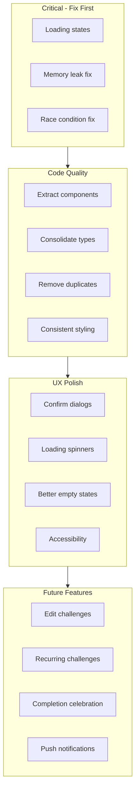

# 250 Club Implementation Review

## Issues Identified

### Critical Issues (Should Fix)

1. **Missing Loading State in TodaysWorkout** ([TodaysWorkout.tsx](src/components/TodaysWorkout.tsx))

   - When `todaysChallenges` is `undefined` (loading), it shows "No Challenge Today" instead of a loading skeleton
   - This is confusing UX - users might think they have no challenges when data is still loading

2. **Memory Leak in Throttle Cleanup** ([TodaysWorkout.tsx](src/components/TodaysWorkout.tsx) lines 74-79)

   - Cleanup effect has `throttleTimeouts` as dependency, causing unnecessary re-runs
   - Should use a ref instead of state for timeout tracking

3. **Race Condition in Quick Actions** ([TodaysWorkout.tsx](src/components/TodaysWorkout.tsx) lines 288-324)

   - `forEach` loops fire multiple `handleRepChange` calls synchronously
   - Each call sets timeouts that may overwrite each other unpredictably

4. **Inefficient User Search** ([friendships.ts](convex/friendships.ts) lines 20-21)

   - `ctx.db.query("users").collect()` scans entire users table
   - Won't scale - should use a search index or text search

### Code Quality Issues (Should Improve)

5. **Inline Component Definition** ([TodaysWorkout.tsx](src/components/TodaysWorkout.tsx) lines 135-195)

   - `PendingInvitationsCard` is defined inside the component
   - Gets recreated every render - should be extracted to a separate component

6. **Duplicate Date Formatting** ([NewChallenge.tsx](src/components/NewChallenge.tsx) lines 147-163)

   - Duplicates `formatDateDisplay` logic that exists in `src/lib/utils.ts`
   - Should import from utils instead

7. **Inconsistent Button Styling**

   - Mix of custom Tailwind classes and shadcn `Button` components
   - Some buttons in `TodaysWorkout.tsx` are raw divs/buttons, others use `Button`

8. **Missing Type Imports** ([TodaysWorkout.tsx](src/components/TodaysWorkout.tsx))

   - Defines `StreakData` and `PendingInvitation` inline instead of importing from types
   - Should consolidate types in `@/types/convex.ts`

9. **No Error Boundaries**

   - Runtime errors crash the entire app
   - Should add error boundaries around major sections

### UX Gaps (Nice to Have)

10. **No Confirmation for Clear All Notifications** ([Notifications.tsx](src/components/Notifications.tsx) line 143)

    - Destructive action happens without confirmation dialog

11. **No Loading Spinners During Mutations**

    - Accept/decline invitations, friend requests show no loading state
    - Users don't know if action is processing

12. **Empty States Lack CTAs**

    - "No past challenges" could have a button to create one
    - "No friends yet" could link to search

13. **Challenge Status Unclear** ([NewChallenge.tsx](src/components/NewChallenge.tsx) line 546)

    - Shows "Status: invited" but no obvious way to accept from this view
    - Should link to Today tab or show accept button inline

14. **Missing Accessibility Labels**

    - +/- buttons in exercise cards lack `aria-label`
    - Tab navigation could be improved

15. **No Completion Celebration**

    - When user completes 100% of a challenge, no celebration feedback
    - Could add confetti, modal, or achievement badge

---

## Improvement Recommendations

### Priority 1: Critical Fixes

| Issue | File | Effort |

| ------------------------------ | ------------------- | ------ |

| Loading state in TodaysWorkout | `TodaysWorkout.tsx` | Small |

| Memory leak in throttle | `TodaysWorkout.tsx` | Small |

| Quick actions race condition | `TodaysWorkout.tsx` | Small |

### Priority 2: Code Quality

| Issue | File | Effort |

| ------------------------------------ | ------------------- | ------ |

| Extract `PendingInvitationsCard` | `TodaysWorkout.tsx` | Small |

| Remove duplicate `formatDateDisplay` | `NewChallenge.tsx` | Small |

| Consolidate types to convex.ts | Multiple | Medium |

| Consistent Button component usage | Multiple | Medium |

| Add error boundaries | `Dashboard.tsx` | Medium |

### Priority 3: UX Polish

| Issue | File | Effort |

| -------------------------------------- | ------------------- | ------ |

| Confirm dialog for clear notifications | `Notifications.tsx` | Small |

| Loading spinners on mutations | Multiple | Medium |

| Improve empty states with CTAs | Multiple | Small |

| Accessibility improvements | Multiple | Medium |

| Completion celebration | `TodaysWorkout.tsx` | Medium |

### Priority 4: Future Features (Not in Scope)

- Edit existing challenges
- Recurring challenges
- Push notifications
- Friend activity feed
- Challenge comments/chat

---

## Summary

The codebase is generally well-structured and maintainable. The main concerns are:

1. **Loading states** - Several components show incorrect UI while data loads
2. **Performance issues** - Memory leak and race conditions in throttling logic
3. **Scalability** - User search does full table scan
4. **Consistency** - Mix of styling approaches and duplicate utilities

The code follows good patterns (type safety, Convex best practices, component organization) but could benefit from the improvements above to polish the experience and prevent edge-case bugs.